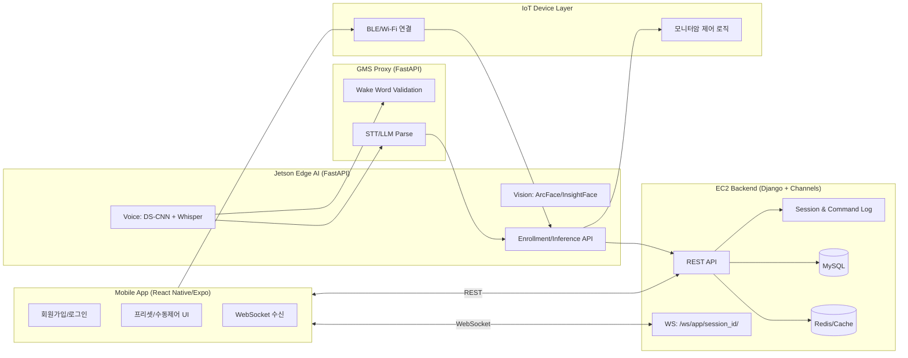

# SARVIS - AIoT Smart Monitor Arm

SARVIS is an AIoT project that combines mobile control, backend session
management, Jetson edge AI, and robot-arm control for a personalized smart
monitor arm.

Source code is not published here because the original team repository is
covered by SSAFY project policy. This public repository is a sanitized project
summary for portfolio and specification review.

## Project Overview

- Program: SSAFY 14th, second-semester main project
- Period: 2026-01-07 to 2026-02-09
- Team: 6 people
- Product: face/voice-aware monitor-arm assistant
- Core flow: mobile app authentication and control, backend session state,
  Jetson vision/voice inference, and robot-arm command execution

## My Role

- Started as a frontend developer and later took on PM/integration ownership
- Documented frontend/backend communication contracts and handoff flows
- Led branch integration and release merges across frontend, backend, and Jetson
  workstreams
- Based on local Git history analysis: 116 of 310 commits were mine, including
  35 direct commits and 81 merge commits

## Tech Stack

| Area | Technologies |
| --- | --- |
| Mobile | React Native, Expo, TypeScript |
| Backend | Django, Django REST Framework, Channels, Celery |
| Realtime | WebSocket, Redis |
| Data | MySQL, JWT-based auth/session state |
| Edge AI | Jetson Nano, Python, FastAPI, OpenCV, InsightFace/ArcFace |
| Voice | DS-CNN wake word, Whisper/STT pipeline, ONNX Runtime |
| Hardware | Robot-arm control, BLE/Wi-Fi onboarding |

## System Architecture



## Main Features

| 기능 | 설명 |
|------|------|
| 다단계 회원가입 + 이메일 인증 | ID/닉네임/이메일/비밀번호 단계 검증 및 이메일 코드 인증 |
| 생체 등록/재등록 | 얼굴 벡터, 음성 벡터 저장 및 재등록 API 제공 |
| 다중 로그인 방식 | 얼굴 로그인 + ID/PW 로그인 + JWT 갱신/로그아웃 |
| 세션 기반 제어 이력 | 세션 시작/종료, 명령 로그 기록 및 조회 흐름 |
| 로봇암 제어/프리셋 | 버튼 제어, 프리셋 저장/선택/수정/이름변경 |
| 실시간 음성 호출 처리 | Jetson 감지 이벤트를 WebSocket으로 앱에 전달 |
| YouTube 핸즈프리 제어 | 앱 접근성 모듈 연동으로 재생/일시정지/탐색 제어 |
| 기기 연결 온보딩 | `SARVIS_WIFI` 및 BLE 기반 연결 절차 안내/검증 |

## Private Source Layout

```text
S14P11A104
├── SARVIS_app/sarvis          # 모바일 앱 (React Native + Expo)
│   ├── app/(auth)             # 인증 플로우 화면
│   ├── app/(tabs)             # 메인 탭 화면
│   ├── api                    # EC2/Jetson API 클라이언트
│   ├── providers              # 인증/연결 상태 관리
│   ├── services               # Foreground Service 등
│   └── modules                # YouTube 제어 모듈
├── BACKEND/djangopjt          # Django/DRF + Channels 백엔드
│   ├── accounts               # 인증/세션/프리셋/제어 API
│   ├── server                 # settings/asgi/celery
│   └── gms_proxy              # FastAPI 기반 STT/LLM/Wake 프록시
├── Jetson                     # Edge AI 파이프라인
│   ├── vision_test            # 얼굴 인식/추적
│   └── voice_test             # Wake/STT/화자검증/명령분류
├── JINWOO                     # 하드웨어/로봇암 제어 관련 코드
└── exec                       # 포팅/운영 문서
```

The tree above documents the original private repository structure. It is
included for architecture review only.

## Key Engineering Experience

- PM transition: repeated frontend/backend/hardware contract mismatch made
  integration slower than feature work, so I moved into an integration role and
  made API/session/control flow decisions explicit.

- Multi-layer debugging: the most important issues crossed app state, backend
  session state, Jetson inference timing, and hardware command behavior.

- Release hygiene: branch integration and release merges were treated as a
  product responsibility, not a last-minute Git task.

## Public Boundary

This repository intentionally excludes:

- Source code covered by SSAFY/team repository policy
- Raw SQL dumps, app archives, device credentials, and private deployment notes
- Biometric, voice, or user-identifying test data
- Live secrets, tokens, and service credentials
