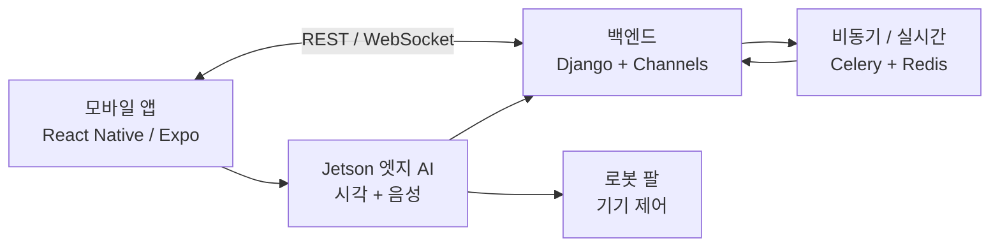

# SARVIS

SARVIS는 얼굴 인식, 음성 인식, 모바일 제어, Jetson 엣지 AI, 로봇 팔 제어를 결합한 AIoT 스마트 모니터링 프로젝트입니다. 사용자는 모바일 앱에서 사용자/세션/기기 상태를 관리하고, 엣지 기기는 얼굴/음성 이벤트를 인식해 백엔드와 로봇 팔 제어 흐름에 연결됩니다.

SSAFY 정책과 팀 소스 보호를 위해 공개 저장소에는 실행 가능한 내부 코드를 공개하지 않습니다. 대신 원본 Git에서 추적하던 폴더명과 파일명을 그대로 복제한 0바이트 파일명 골격을 포함해, 시스템 규모와 구성은 확인할 수 있게 했습니다.

## 커리어 근거로 읽는 법

| 항목 | 내용 |
| --- | --- |
| 프로젝트 유형 | SSAFY 공통 프로젝트, 6인 AIoT 팀 프로젝트 |
| 내 역할 | 프론트엔드 구현, 백엔드 API 조율, 스프린트 2 이후 PM/팀장 역할 |
| 주력 기술 | React Native/Expo, TypeScript, Kotlin, Django/DRF, FastAPI, Redis, InsightFace, ONNX, OpenCV, Whisper |
| 보여주고 싶은 역량 | 프론트엔드/백엔드/Jetson/하드웨어가 나뉜 팀에서 API 계약과 통합 기준을 맞추는 역량 |
| 결과 | SSAFY 공통과정 프로젝트 우수상 |

제가 이 프로젝트에서 강조하고 싶은 부분은 특정 화면 하나보다, **서로 다른 파트가 다른 가정을 가진 상태에서 API 계약과 커뮤니케이션 기준을 맞춰 통합을 안정화한 경험**입니다. 공개 저장소는 파일명 골격만 제공하지만, 실제 원본 파일명 구조를 통해 모바일, 백엔드, Jetson, 하드웨어 작업 영역의 범위를 확인할 수 있습니다.

## 프로젝트 개요

| 항목 | 내용 |
| --- | --- |
| 과정 | SSAFY 14기 2학기 메인 프로젝트 |
| 기간 | 2026-01-07 - 2026-02-09 |
| 팀 구성 | 6인 |
| 제품 방향 | 얼굴/음성 인식 기반 AIoT 모니터링 도우미 |
| 공개 방식 | README + 실제 원본 파일명 골격 + 구조 문서 |

## 문제 정의

일반적인 IoT 제어 앱은 기기 상태 표시와 버튼 제어에 머무는 경우가 많습니다. SARVIS는 사용자가 직접 조작하지 않아도 얼굴, 음성, 세션 상태를 바탕으로 기기 제어 흐름을 이어갈 수 있는 구조를 목표로 했습니다.

제품 관점에서 중요한 지점은 다음과 같습니다.

- 모바일 앱은 사용자와 기기 상태를 이해하기 쉬운 조작면으로 제공한다.
- 백엔드는 인증, 세션, WebSocket, 비동기 작업을 담당한다.
- Jetson 엣지 기기는 얼굴/음성 추론과 현장 이벤트를 처리한다.
- 로봇 팔 제어는 엣지/백엔드 이벤트를 물리 동작으로 연결한다.
- 프론트엔드, 백엔드, Jetson, 하드웨어 작업 영역이 서로 다른 속도로 개발되므로 통합 계약이 중요하다.

## 담당 역할

초기에는 프론트엔드 개발자로 참여했고, 스프린트 중반 이후 PM/통합 역할을 함께 맡았습니다.

- React Native/Expo 기반 모바일 화면과 사용자 흐름 구현
- FE/BE API 계약과 WebSocket 이벤트 흐름 정리
- 백엔드, Jetson, 하드웨어 작업 영역 간 인수인계 문서화
- 브랜치 통합과 배포 병합 조율
- 로컬 Git 이력 분석 기준 전체 310개 커밋 중 116개 커밋에 관여

## 핵심 기능

| 영역 | 기능 |
| --- | --- |
| 모바일 앱 | 회원가입, 로그인, 사용자 프로필, 기기 제어, 세션 상태 표시 |
| 실시간 | WebSocket 기반 감지 이벤트와 상태 동기화 |
| 백엔드 | Django REST API, Channels, Celery, Redis, MySQL |
| 엣지 AI | Jetson 기반 얼굴 인식, 음성 wake word/STT, OpenCV/ONNX 추론 |
| 하드웨어 | 로봇 팔 preset, 수동 제어, BLE/Wi-Fi 온보딩 |
| 통합 | 모바일, 백엔드, 엣지, 하드웨어 간 이벤트 인수인계 |

## 시스템 개요

## 기술 스택

| 영역 | 기술 |
| --- | --- |
| 모바일 | React Native, Expo, TypeScript |
| 백엔드 | Django, Django REST Framework, Channels, Celery |
| 실시간/큐 | WebSocket, Redis |
| 데이터베이스/인증 | MySQL, JWT |
| 엣지 AI | Jetson Nano, Python, FastAPI, OpenCV, InsightFace/ArcFace |
| 음성 | DS-CNN wake word, Whisper/STT, ONNX Runtime |
| 하드웨어 | 로봇 팔 제어, BLE/Wi-Fi 온보딩 |

## 공개 저장소 구성

- [REPOSITORY_STRUCTURE.md](./REPOSITORY_STRUCTURE.md): 원본 Git 추적 파일 전체 구조
- 각 파일명 골격 파일: 원본 파일명을 보존하기 위한 0바이트 자리 표시 파일
- 루트 `README.md`: 공개 설명 문서

소스코드 내용, 비밀값, 덤프, 압축 보관 파일, 기기 인증 정보, 생체/음성/사용자 식별 데이터는 공개하지 않습니다.

## 공개하지 않는 항목

- React Native, Django, Jetson 내부 구현 코드
- SQL 덤프, 앱 압축 보관 파일, 비공개 배포 노트
- 기기 인증 정보, SSH 키, 토큰, 서비스 인증 정보
- 얼굴/음성/사용자 식별 테스트 데이터
- 비공개 소스 이력과 팀 내부 문서

전체 개발 이력과 복구 자료는 비공개 원격 저장소 및 별도 백업에서 관리합니다.
