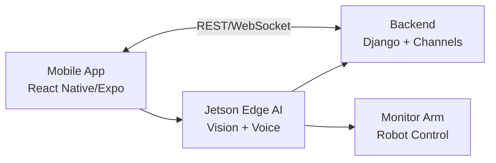

# SARVIS

SARVIS는 얼굴/음성 기반 사용자 인식과 로봇암 제어를 결합한 AIoT 스마트 모니터암 프로젝트입니다. 모바일 앱, 백엔드 세션 관리, Jetson edge AI, 하드웨어 제어가 하나의 사용자 제어 흐름으로 연결됩니다.

SSAFY 정책과 팀 소스 보호를 위해 public repo에는 내부 코드가 아니라 README와 구조/파일명 인벤토리만 둡니다.

## 프로젝트 개요

- 과정: SSAFY 14기 2학기 메인 프로젝트
- 기간: 2026-01-07 ~ 2026-02-09
- 팀 구성: 6인
- 제품: 얼굴/음성 인식 기반 퍼스널 모니터암 assistant
- 핵심 흐름: 모바일 인증/제어, 백엔드 세션 상태, Jetson vision/voice inference, 로봇암 명령 수행

## 담당 역할

- Frontend 개발자로 시작해 sprint 중반부터 PM/integration 역할 수행
- FE/BE 통신 계약과 앱/백엔드/Jetson handoff 흐름 문서화
- frontend, backend, Jetson workstream의 branch integration과 release merge 주도
- local Git history 분석 기준 전체 310개 commit 중 116개 commit에 관여

## 기술 스택

| 영역 | 기술 |
| --- | --- |
| Mobile | React Native, Expo, TypeScript |
| Backend | Django, Django REST Framework, Channels, Celery |
| Realtime | WebSocket, Redis |
| Data/Auth | MySQL, JWT |
| Edge AI | Jetson Nano, Python, FastAPI, OpenCV, InsightFace/ArcFace |
| Voice | DS-CNN wake word, Whisper/STT, ONNX Runtime |
| Hardware | Robot arm control, BLE/Wi-Fi onboarding |

## 시스템 구조

## 핵심 기능

- 다단계 회원가입과 이메일 인증
- 얼굴/음성 생체 등록과 재등록
- 얼굴 로그인과 ID/PW 로그인
- 세션 기반 제어 이력
- 로봇암 수동 제어와 preset 관리
- Jetson 감지 event의 WebSocket 전달
- YouTube hands-free 제어
- BLE/Wi-Fi 기반 기기 연결 onboarding

## 비공개 소스 구조

코드는 공개하지 않고 파일명/구조만 별도 문서로 남깁니다.

- [REPOSITORY_STRUCTURE.md](./REPOSITORY_STRUCTURE.md)

## 공개/비공개 경계

public repo에는 다음을 넣지 않습니다.

- React Native/Django/Jetson 내부 구현 코드
- SQL dump, app archive, device credential, private deployment note
- biometric, voice, user-identifying test data
- live secret, token, service credential

전체 개발 history는 원본 private remote와 private backup에서 관리합니다.
