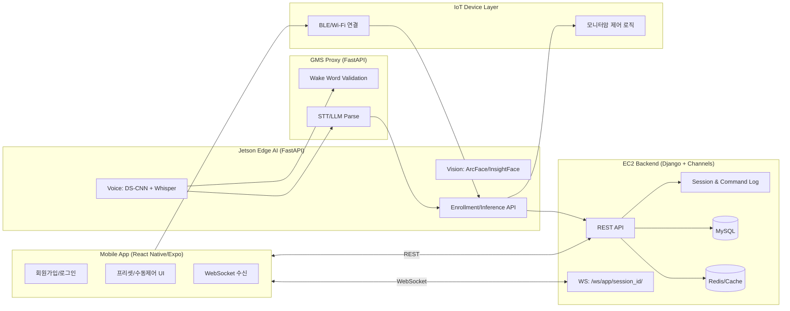

# 🤖 SARVIS — AIoT 기반 지능형 사용자 인식 모니터암
>
> ⚠️ SSAFY 교육 정책에 따라 소스코드는 비공개입니다.

## 📌 프로젝트 개요

- **SARVIS**는 얼굴/음성 기반 사용자 인식과 로봇암 제어를 결합한 **AIoT 퍼스널 모니터암** 프로젝트입니다.
- 모바일 앱에서 사용자 인증 및 제어를 수행하고, Jetson Edge AI가 비전/음성 파이프라인을 처리하며, 백엔드가 세션/명령/계정 상태를 통합 관리합니다.
- **SSAFY 14기 2학기 메인 프로젝트**
- **기간:** 2026.01 ~ 2026.02 (2026.01.07 ~ 2026.02.09)
- **팀 구성:** 6인

## 🎯 담당 역할

- FrontEnd 개발자로 시작해, 스프린트 중반부터 PM 역할로 자발적 전환
- FE/BE 양쪽 코드베이스 및 통신 구조 문서화에 기여
- 팀 브랜치 통합 및 릴리즈 머지 주도
- `git log` 분석 기준:
  - 전체 **310개** 커밋 중 본인 **116개 (37.42%)**
  - 본인 커밋 구성: **직접 커밋 35개 + 머지 커밋 81개**
  - 머지 기여: `feature/BE` 5회, `feature/FE` 7회, Jetson 관련 12회
  - 변경 로그 기준 주요 기여 경로: `SARVIS_app`, `app_UI`, `FRONTEND`, `김대연`(기획/명세)

## 🛠️ 기술 스택


## 🏗️ 시스템 아키텍처



## ⭐ 주요 기능

| 기능 | 설명 |
|------|------|
| 다단계 회원가입 + 이메일 인증 | ID/닉네임/이메일/비밀번호 단계 검증 및 이메일 코드 인증 |
| 생체 등록/재등록 | 얼굴 벡터, 음성 벡터 저장 및 재등록 API 제공 |
| 다중 로그인 방식 | 얼굴 로그인 + ID/PW 로그인 + JWT 갱신/로그아웃 |
| 세션 기반 제어 이력 | 세션 시작/종료, 명령 로그 기록 및 조회 흐름 |
| 로봇암 제어/프리셋 | 버튼 제어, 프리셋 저장/선택/수정/이름변경 |
| 실시간 음성 호출 처리 | Jetson 감지 이벤트를 WebSocket으로 앱에 전달 |
| YouTube 핸즈프리 제어 | 앱 접근성 모듈 연동으로 재생/일시정지/탐색 제어 |
| 기기 연결 온보딩 | `SARVIS_WIFI` 및 BLE 기반 연결 절차 안내/검증 |

## 📁 프로젝트 구조

```text
S14P11A104
├── SARVIS_app/sarvis          # 모바일 앱 (React Native + Expo)
│   ├── app/(auth)             # 인증 플로우 화면
│   ├── app/(tabs)             # 메인 탭 화면
│   ├── api                    # EC2/Jetson API 클라이언트
│   ├── providers              # 인증/연결 상태 관리
│   ├── services               # Foreground Service 등
│   └── modules                # YouTube 제어 모듈
├── BACKEND/djangopjt          # Django/DRF + Channels 백엔드
│   ├── accounts               # 인증/세션/프리셋/제어 API
│   ├── server                 # settings/asgi/celery
│   └── gms_proxy              # FastAPI 기반 STT/LLM/Wake 프록시
├── Jetson                     # Edge AI 파이프라인
│   ├── vision_test            # 얼굴 인식/추적
│   └── voice_test             # Wake/STT/화자검증/명령분류
├── JINWOO                     # 하드웨어/로봇암 제어 관련 코드
└── exec                       # 포팅/운영 문서
```

## 💡 핵심 경험 & 성장

- **PM 전환 스토리**  
  스프린트 진행 중 FE/BE/HW 간 통신 규약 불일치로 충돌이 반복되었고, 이를 해결하기 위해 PM 역할로 전환해 상세 명세/API 기준을 통합했습니다.

- **기술적 챌린지 해결**  
  실시간 음성 호출(WebSocket), 생체 인증 파이프라인(Jetson↔Backend), 앱 백그라운드 동작(Foreground Service) 등 다중 계층 연동 이슈를 구조화하여 해결했습니다.

## 📸 스크린샷
<!-- 추후 추가 예정 -->
