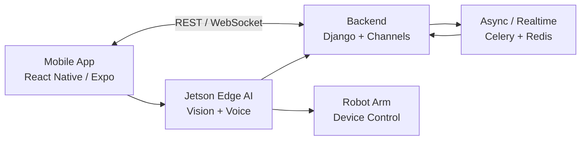

# SARVIS

SARVIS는 얼굴 인식, 음성 인식, 모바일 제어, Jetson edge AI, robot arm 제어를 결합한 AIoT 스마트 모니터링 프로젝트입니다. 사용자는 모바일 앱에서 사용자/세션/기기 상태를 관리하고, edge device는 얼굴/음성 이벤트를 인식해 backend와 robot arm 제어 흐름에 연결됩니다.

SSAFY 정책과 팀 소스 보호를 위해 public repo에는 실행 가능한 내부 코드를 공개하지 않습니다. 대신 원본 Git에서 추적하던 폴더명과 파일명을 그대로 복제한 0바이트 skeleton을 포함해, 시스템 규모와 구성은 확인할 수 있게 했습니다.

## 프로젝트 개요

| 항목 | 내용 |
| --- | --- |
| 과정 | SSAFY 14기 2학기 메인 프로젝트 |
| 기간 | 2026-01-07 - 2026-02-09 |
| 팀 구성 | 6인 |
| 제품 방향 | 얼굴/음성 인식 기반 AIoT 모니터링 assistant |
| 공개 방식 | README + 실제 원본 파일명 skeleton + 구조 문서 |

## 문제 정의

일반적인 IoT 제어 앱은 기기 상태 표시와 버튼 제어에 머무는 경우가 많습니다. SARVIS는 사용자가 직접 조작하지 않아도 얼굴, 음성, 세션 상태를 바탕으로 기기 제어 흐름을 이어갈 수 있는 구조를 목표로 했습니다.

제품 관점에서 중요한 지점은 다음과 같습니다.

- 모바일 앱은 사용자와 기기 상태를 이해하기 쉬운 조작면으로 제공한다.
- backend는 인증, 세션, WebSocket, 비동기 작업을 담당한다.
- Jetson edge device는 얼굴/음성 inference와 현장 이벤트를 처리한다.
- robot arm 제어는 edge/backend 이벤트를 물리 동작으로 연결한다.
- FE, BE, Jetson, hardware workstream이 서로 다른 속도로 개발되므로 integration contract가 중요하다.

## 담당 역할

초기에는 frontend 개발자로 참여했고, sprint 중반 이후 PM/integration 역할을 함께 맡았습니다.

- React Native/Expo 기반 모바일 화면과 사용자 흐름 구현
- FE/BE API 계약과 WebSocket 이벤트 흐름 정리
- backend, Jetson, hardware workstream 간 handoff 문서화
- branch integration과 release merge 조율
- 로컬 Git history 분석 기준 전체 310개 commit 중 116개 commit에 관여

## 핵심 기능

| 영역 | 기능 |
| --- | --- |
| Mobile app | 회원가입, 로그인, 사용자 프로필, 기기 제어, 세션 상태 표시 |
| Realtime | WebSocket 기반 감지 이벤트와 상태 동기화 |
| Backend | Django REST API, Channels, Celery, Redis, MySQL |
| Edge AI | Jetson 기반 얼굴 인식, 음성 wake word/STT, OpenCV/ONNX inference |
| Hardware | robot arm preset, 수동 제어, BLE/Wi-Fi onboarding |
| Integration | 모바일, backend, edge, hardware 간 이벤트 handoff |

## 시스템 개요

## 기술 스택

| 영역 | 기술 |
| --- | --- |
| Mobile | React Native, Expo, TypeScript |
| Backend | Django, Django REST Framework, Channels, Celery |
| Realtime / Queue | WebSocket, Redis |
| Database / Auth | MySQL, JWT |
| Edge AI | Jetson Nano, Python, FastAPI, OpenCV, InsightFace/ArcFace |
| Voice | DS-CNN wake word, Whisper/STT, ONNX Runtime |
| Hardware | robot arm control, BLE/Wi-Fi onboarding |

## 공개 repo 구성

- [REPOSITORY_STRUCTURE.md](./REPOSITORY_STRUCTURE.md): 원본 Git tracked file 전체 구조
- 각 skeleton 파일: 원본 파일명을 보존하기 위한 0바이트 placeholder
- 루트 `README.md`: 공개 설명 문서

소스코드 내용, secret, dump, archive, device credential, biometric/voice/user-identifying data는 공개하지 않습니다.

## 공개하지 않는 항목

- React Native, Django, Jetson 내부 구현 코드
- SQL dump, app archive, private deployment note
- device credential, SSH key, token, service credential
- 얼굴/음성/사용자 식별 테스트 데이터
- private source history와 팀 내부 문서

전체 개발 history와 복구 자료는 private remote 및 별도 백업에서 관리합니다.
